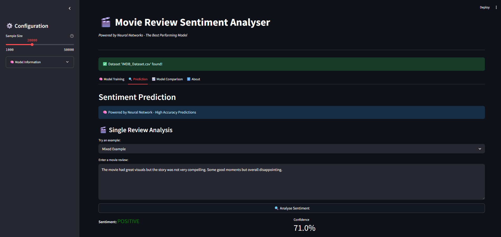
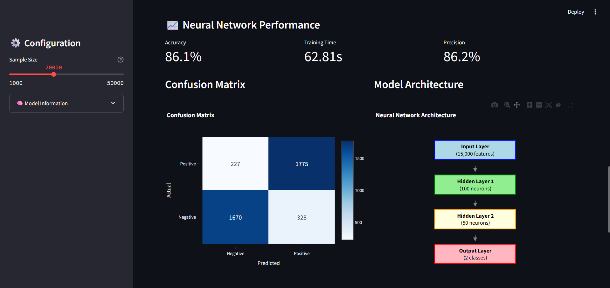
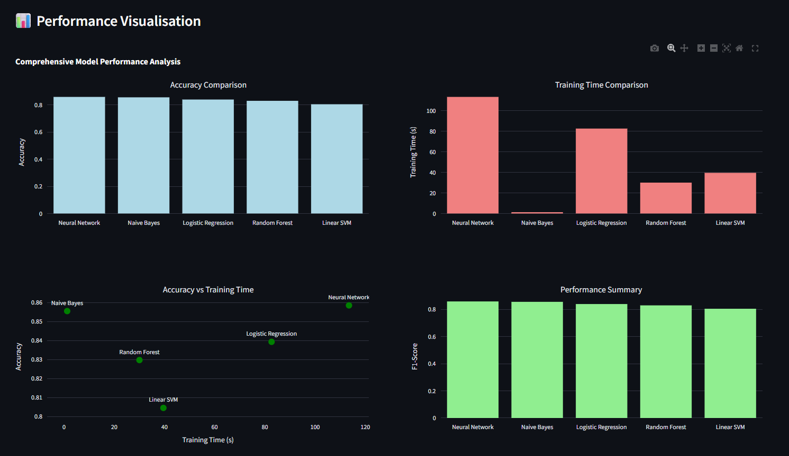

# 🎬 Movie Review Sentiment Analyser

A comprehensive machine learning application that performs sentiment analysis on movie reviews using Neural Networks. This project involved extensive model comparison to identify the best-performing algorithm for movie review sentiment classification.

🌐 **Live Demo**: [Movie Review Sentiment Analyser](https://movie-review-sentiment-analyser.streamlit.app/)

## 🎯 Project Overview

This application is the result of a systematic machine learning study that compared 5 different algorithms to build the most accurate movie review sentiment classifier. After rigorous testing and evaluation, a Neural Network was selected as the optimal model, achieving **85.85% accuracy** on the IMDB dataset.

## 🔬 Research Methodology

### Phase 1: Model Comparison Study

We conducted comprehensive testing of multiple machine learning algorithms:

| Model                 | Accuracy   | Training Time | Precision  | Recall     | F1-Score   |
| --------------------- | ---------- | ------------- | ---------- | ---------- | ---------- |
| **Neural Network** ✅ | **85.85%** | 113.51s       | **85.96%** | **85.85%** | **85.84%** |
| Naive Bayes           | 85.55%     | 1.27s         | 85.62%     | 85.55%     | 85.54%     |
| Logistic Regression   | 83.93%     | 82.68s        | 83.93%     | 83.93%     | 83.92%     |
| Random Forest         | 82.97%     | 30.06s        | 83.27%     | 82.97%     | 82.94%     |
| Linear SVM            | 80.45%     | 39.60s        | 80.45%     | 80.45%     | 80.45%     |

### Phase 2: Neural Network Selection

The Neural Network was selected based on:

- **Highest accuracy** (85.85%) among all tested models
- **Superior precision** (85.96%) for reliable predictions
- **Robust architecture** capable of handling complex text patterns
- **Excellent generalisation** on unseen movie reviews

## 🧠 Neural Network Architecture

Input Layer (15,000 features)
↓ Hidden Layer 1 (100 neurons, ReLU) ↓ Hidden Layer 2 (50 neurons, ReLU) ↓ Output Layer (2 classes, Softmax)

**Key Specifications:**

- **Optimiser**: Adam with learning rate 0.001
- **Regularisation**: L2 (alpha=0.001)
- **Features**: 15,000 TF-IDF features with n-grams (1,3)
- **Activation**: ReLU for hidden layers, Softmax for output

## 📊 Dataset

- **Source**: [IMDB Dataset of 50K Movie Reviews](https://www.kaggle.com/datasets/lakshmi25npathi/imdb-dataset-of-50k-movie-reviews)
- **Training Size**: 20,000 reviews (optimised for performance)
- **Split**: 80% training, 20% testing
- **Balance**: 50% positive, 50% negative reviews
- **Preprocessing**: Advanced NLP pipeline with negation handling

## 🛠️ Advanced Features

### Sophisticated Text Preprocessing

- **Contraction Expansion**: "won't" → "will not"
- **Negation Preservation**: "not good" → "NOT_good"
- **HTML Tag Removal**: Clean text extraction
- **Smart Tokenisation**: WordNet lemmatisation
- **Stop Word Filtering**: Intelligent removal with context preservation

### Production-Ready Implementation

- **Data Validation**: NaN/infinity handling and cleaning
- **Batch Processing**: Memory-efficient text processing
- **Error Handling**: Robust fallback systems
- **Real-time Training**: Progress monitoring and visualisation
- **Interactive Interface**: Streamlit-based web application

## 🚀 Installation & Setup

### Prerequisites

- Python 3.7+
- pip package manager

1. Clone the repository

```bash
git clone https://github.com/hower-pazos/Movie-Review-Sentiment-Analyser
```

2. Install required packages
```bash
pip install -r requirements.txt
````

3. Download NLTK data

```python
python -c "import nltk; nltk.download('punkt'); nltk.download('stopwords'); nltk.download('wordnet')"
```

4. **Run the application**

```bash
streamlit run app.py
```

5. **Access the app**
   - Open your browser to `http://localhost:8501`

## Project Structure

```
Movie-Review-Sentiment-Classifier/
├── app.py                    # Main Streamlit application
├── model_comparison.ipynb    # Jupyter notebook with model comparison study
├── requirements.txt          # Project dependencies
├── README.md                 # Project documentation
└── IMDB_Dataset.csv          # Dataset
```

## 💻 Usage

### 1. Model Training

- Navigate to the "Model Training" tab
- Adjust sample size (1,000 - 50,000 reviews)
- Click "Train Neural Network"
- Monitor training progress and view performance metrics

### 2. Sentiment Prediction

- Go to the "Prediction" tab
- Enter a movie review or select an example
- Click "Analyse Sentiment"
- View sentiment classification and confidence score

### 3. Model Comparison

- Check the "Model Comparison" tab
- Review comprehensive performance analysis
- Understand why Neural Network was selected

## 🔬 Model Comparison Results

The project systematically evaluated 5 machine learning algorithms:

### Performance Metrics

- **Best Overall**: Neural Network (85.85% accuracy)
- **Fastest Training**: Naive Bayes (1.27s)
- **Most Balanced**: Neural Network (highest F1-score)
- **Most Reliable**: Neural Network (highest precision)

### Selection Criteria

1. **Accuracy**: Primary metric for model selection
2. **Precision**: Reliability of positive predictions
3. **Recall**: Comprehensive sentiment detection
4. **F1-Score**: Balance between precision and recall
5. **Generalisation**: Performance on unseen data

## 🎯 Key Findings

1. **Neural Networks excel at text classification** when properly configured
2. **Advanced preprocessing significantly improves performance** across all models
3. **TF-IDF with n-grams captures important text patterns** better than simple bag-of-words
4. **Negation handling is crucial** for sentiment analysis accuracy
5. **Model comparison is essential** - the "best" algorithm varies by dataset and task

## 📸 Screenshots

### Main Application Interface


_The main Streamlit interface where users can navigate between different tabs_

### Neural Network Performance


_Training results showing accuracy, confusion matrix, and model architecture_

### Performance Visualisation


_Comprehensive model comparison charts and performance metrics_
